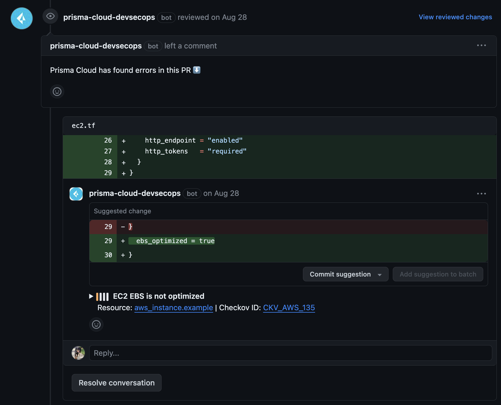

# What is Checkov?

Checkov is a static code analysis tool for scanning infrastructure as code (IaC) files for misconfigurations that may lead to security or compliance problems. Checkov includes more than 750 predefined policies to check for common misconfiguration issues. Checkov also supports the creation and contribution of [custom policies](https://www.checkov.io/3.Custom%20Policies/Custom%20Policies%20Overview.html).

## Supported IaC types

Checkov scans these IaC file types:

* Terraform (for AWS, GCP, Azure and OCI)
* CloudFormation (including AWS SAM)
* Azure Resource Manager (ARM)
* Serverless framework
* Helm charts
* Kubernetes
* Docker

## Custom policies

Custom policies can be created to check cloud resources based on configuration attributes (in [Python](https://www.checkov.io/3.Custom%20Policies/Python%20Custom%20Policies.html) or [YAML](https://www.checkov.io/3.Custom%20Policies/YAML%20Custom%20Policies.html) or connection states (in [YAML](https://www.checkov.io/3.Custom%20Policies/YAML%20Custom%20Policies.html)). For composite policies, Checkov creates a cloud resource connection graph for deep misconfiguration analysis across resource relationships.

## Compliance with Industry Standards

In addition, Checkov scans for compliance with common industry standards such as the Center for Internet Security (CIS) and Amazon Web Services (AWS) Foundations Benchmark.

## Integrates seamlessly with Prisma Cloud

Checkov integrates with advanced features in [Prisma Cloud](https://www.prismacloud.io/prisma/cloud/cloud-code-security). Prisma Cloud extends Checkov's capabilities to provide runtime scanning and visibility, native VCS integrations, drift detection, and more.

### Runtime Scanning and Drift Detection

Prisma Cloud can validate Checkov IaC policies against your runtime cloud environments in AWS, Azure, Google Cloud, AliCloud, and Oracle Cloud Infrastructure, allowing you to find and fix issues in existing deployments and detect cloud drifts. Read more in [Prisma Cloud's documentation](https://docs.prismacloud.io/en/enterprise-edition). Prisma Cloud will detect drift and provide automatic pull requests to fix drifted resources in HCL.

### Pull Request Annotations

Enable automated pull/merge request annotations on your repositories without having to build a CI pipeline or run scheduled checks. Prisma Cloud will automatically scan new pull requests and annotate them with comments for any policy violations discovered. Read more in [Prisma Cloud's documentation](https://docs.prismacloud.io/en/enterprise-edition/content-collections/application-security/get-started/connect-code-and-build-providers/code-repositories/code-repositories).

