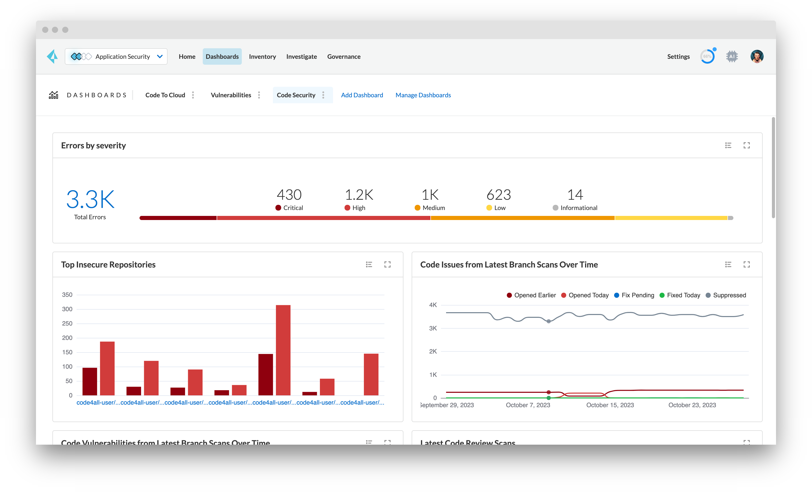
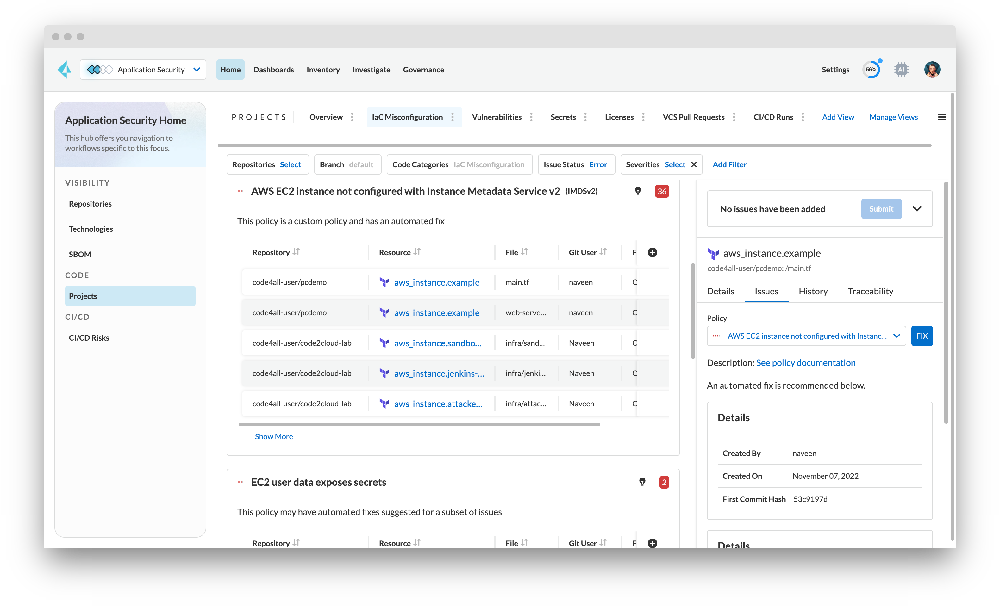

# Visualizing Checkov Output in Prisma Cloud

You can integrate Checkov with Prisma Cloud to view the results of Checkov scans in Prisma Cloud.


## Integration

### Get your Access Key and Secret Key

To get a Prisma Cloud issued Access Key and Secret Key token, follow the steps in the [Prisma Cloud documentation](https://docs.prismacloud.io/en/enterprise-edition/content-collections/application-security/get-started/connect-code-and-build-providers/ci-cd-runs/add-checkov).

## Execution

After acquiring the Access Key and Secret Key token, run Checkov as follows:

```shell
checkov -d <directory> --bc-api-key <access key>::<secret key> --prisma-api-url <prisma api url> --repo-id <repo_id> --branch <branch>
```

Or by using the `-f` file flag:

```shell
checkov -f <file_1> <file_2> ... <file_n> --bc-api-key <access key>::<secret key> --prisma-api-url <prisma api url> --repo-id <repo_id> --branch <branch>
```

The table below details the arguments used when executing the API token:

| Argument | Description |
| -------- | ----------- |
| `<access key>::<secret key>` | Prisma cloud API key in the following format `ACCESS_KEY::SECRET_KEY` |
| `<repo_id>` | Identifying string of the scanned repository, following the standard Git repository naming scheme: `<owner>/<name>` |
| `<branch>` | Branch name to be persisted on platform. Defaults to the master branch. **NOTE:** Ensure the scanned directory (supplied in the `-d` flag) is currently checked out from the given branch name. |

### Environment Variables

To enrich Prisma Cloud's context with CI/CD systems data, we strongly recommend that Checkov uses environment variables.

| Environment Variable            | Description                                                                    | Example                                                                                 |
|---------------------------------|--------------------------------------------------------------------------------|-----------------------------------------------------------------------------------------|
| BC_FROM_BRANCH                  | Source branch                                                                  | feature/foo                                                                             |
| BC_TO_BRANCH                    | Target branch                                                                  | main                                                                                    |
| BC_PR_ID                        | Pull request identifier                                                        | 825                                                                                     |
| BC_PR_URL                       | Link to pull request/merge request                                             | https://github.com/bridgecrewio/checkov/pull/825                                        |
| BC_COMMIT_HASH                  | Commit identifier                                                              | 5df50ab857e7a255e4e731877748b539915ad489                                                |
| BC_COMMIT_URL                   | Link to commit in CI/VCS system                                                | https://github.com/bridgecrewio/checkov/commit/5df50ab857e7a255e4e731877748b539915ad489 |
| BC_AUTHOR_NAME                  | User associated with the CI trigger                                            | schosterbarak                                                                           |
| BC_AUTHOR_URL                   | Link to the user profile page                                                  | https://github.com/schosterbarak                                                        |
| BC_RUN_ID                       | CI run identifier                                                              | 525220526                                                                               |
| BC_RUN_URL                      | Link to the run in the CI system                                               | https://github.com/bridgecrewio/checkov/actions/runs/525220526                          |
| BC_REPOSITORY_URL               | Link to the GitHub repository                                                  | https://github.com/bridgecrewio/checkov/                                                |
| BC_SOURCE                       | Name of CI system being integrated                                             | githubActions                                                                           |
| PRISMA_API_URL                  | URL of Prisma app for platform integration                                     | https://app3.prismacloud.io                                                             |
| SLS_FILE_MASK                   | File names mask for all serverless files                                       | serverless.yaml,serverless.yml                                                          |
| CHECKOV_REQUEST_CONNECT_TIMEOUT | Number of seconds requests will wait to establish a connection to the platform | 3.1                                                                                     |
| CHECKOV_REQUEST_READ_TIMEOUT    | Number of seconds requests will wait for the platform to send a response. This duration matches our timeout settings, so changes are likely unnecessary.      | 30                                                                                      |
| CHECKOV_REQUEST_RETRIES         | Number of retries requests will do towards the platform                        | 3                                                                                       |

## Prisma Cloud platform view

After successfully executing, scan results are persisted in [Prisma Cloud](https://www.prismacloud.io), and can be seen in Projects.


