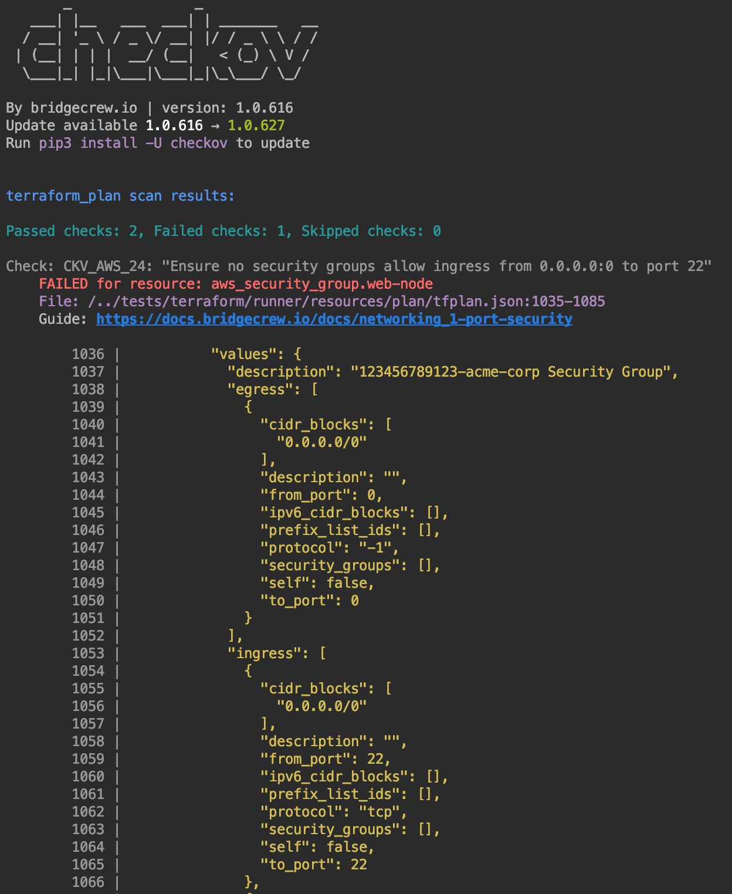

# Evaluate Checkov policies on Terraform plan

Checkov supports the evaluation of policies on resources declared in `.tf` files. It can also be used to evaluate `terraform plan` expressed in a json file.
Plan evaluation provides Checkov additional dependencies and context that can result in a more complete scan result.
Since Terraform plan files may contain arguments (like secrets) that are injected dynamically, it is advised to run a plan evaluation using Checkov in a secure CI/CD pipeline setting.

## Example

```bash
terraform init
terraform plan --out tfplan.binary
terraform show -json tfplan.binary > tfplan.json

checkov -f tfplan.json

```
### Example output:


