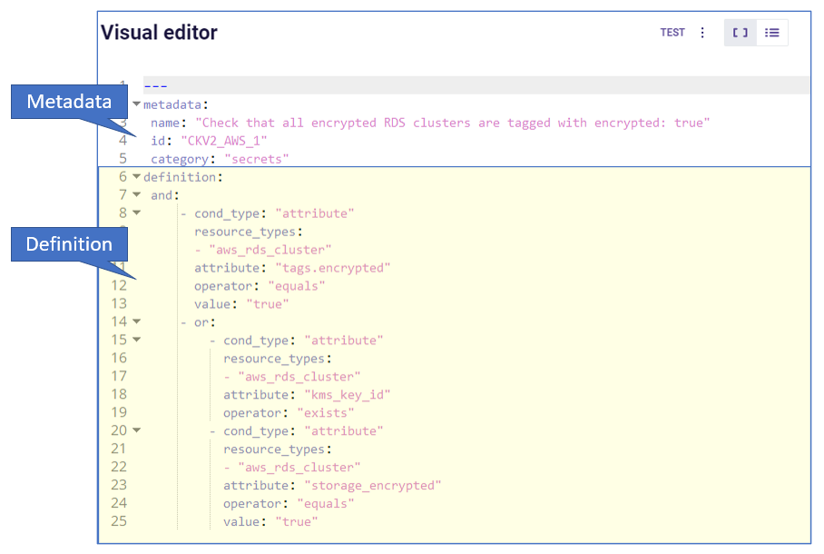

# Create Custom Policy - YAML - Attribute Check and Composite

Custom policies created in YAML support checking a resource’s connection state and the use of complex AND/OR logic. Read also how to [create custom Python Policies for attribute scanning](https://www.checkov.io/3.Custom%20Policies/Python%20Custom%20Policies.html).

A YAML-based custom policy for Checkov consists of sections for the **Metadata** and **Policy Definition**.



**Metadata**

The Metadata includes:

* Policy Name
* ID - `CKV2_<provider>_<number>`
* Category
* Guideline (optional)
* Severity (optional) - can be `INFO`, `LOW`, `MEDIUM`, `HIGH`, `CRITICAL`

The possible values for category are:

* GENERAL_SECURITY
* LOGGING
* ENCRYPTION
* NETWORKING
* IAM
* BACKUP_AND_RECOVERY
* CONVENTION
* SECRETS
* KUBERNETES
* APPLICATION_SECURITY
* SUPPLY_CHAIN
* API_SECURITY 

The possible values for severity are:

* INFO
* LOW
* MEDIUM
* HIGH
* CRITICAL

```yaml
metadata:
  id: "CKV2_CUSTOM_1"
  name: "Ensure bucket has versioning and owner tag"
  category: "BACKUP_AND_RECOVERY"
  guideline: "https://docs.prismacloud.io/en/enterprise-edition/policy-reference/aws-policies/aws-general-policies/ckv2_custom_1"
  severity: "HIGH"
```

## Policy Definition

The policy definition consists of:

* **Definition Block(s)** - either *Attribute Block(s)* or *Connection State Block(s)* or both
* **Logical Operator(s)** (optional)
* **Filter** (optional)

The top level object under `definition` must be a single object (not a list). It can be an attribute block, a connection block, or a logical operator (`and`, `or`, `not`).

## Types of Definition Blocks

* **Attribute Blocks:** The policy describes resources with a certain configuration as defined by a configuration **attribute** and its value (per Terraform), or by the presence/absence of an attribute.
* **Connection State Blocks:**  The policy describes resources in a particular **Connection state**; either connected or not connected to another type of resource (for example, a security group).
* **Resource Type Blocks:** The policy describes resource types that are either allowed or forbidden to use, commonly referred to as allow/deny lists.

### Using AND/OR Logic
A policy definition may include multiple blocks (**Attribute**, **Connection state** or both), associated by **AND/OR** logic.

### Using NOT Logic
A policy definition may include any block (**Attribute**, **Connection state**, or **AND/OR**) underneath a `not` block to invert the statement.

## Attribute Blocks

An **Attribute Block** in a policy's definition indicates that a resource will be non-compliant if a certain configuration attribute does not have a specified value or if it exists/doesn't exist.

Prisma Cloud's custom policies in code utilize the Terraform attribute library and syntax. These policies are checked during scans of both build-time and runtime resources and for all supported cloud providers.

### Attribute Block Example

The Attribute Block in the `definition` in the example below is used to ensure that a proper back-up policy is configured for Redshift clusters:

```yaml
definition:
     cond_type: "attribute"
     resource_types:
     - "aws_redshift_cluster"
     attribute: "automated_snapshot_retention_period"
     operator: "not_equals"
     value: "0"
```

### Attribute Condition: Operators

| Value in YAML                  | Description                                      | Value types       | Example                                           |
|--------------------------------|--------------------------------------------------|-------------------|---------------------------------------------------|
| `equals`                       | Exact value match                                | String, Int, Bool | operator: "equals"<br>value: "t3.nano"            |
| `not_equals`                   | Not equal to the value                           | String, Int, Bool | operator: "not_equals"<br>value: "t3.nano"        |
| `regex_match`                  | The value must match the regular <br>expression      | String (RegEx)    | operator: "regex_match"<br>value: "^myex-.*"      |
| `not_regex_match`              | The value must not match the regular <br>expression  | String (RegEx)    | operator: "not_regex_match"<br>value: "^myex-.*"  |
| `exists`                       | The attribute or connection appears in the <br>resource definition | None              | attribute: "name"<br>operator: exists |
| `not_exists`                   | The attribute or connection does not <br>appear in the resource    | None              | attribute: "name"<br>operator: not_exists |
| `one_exists`                   | At least one connection of a specific type <br>exists | None         | resource_types:<br>  - aws_vpc<br>connected_resource_types:<br>  - aws_flow_log<br>operator: one_exists<br>attribute: networking<br>cond_type: connection |
| `any`                          | Any of a list of attribute values match what <br>the resource contains  | (List) Strings    | operator: "any"<br>value: <br>-"value1" |
| `contains`                     | The values of a resource attribute includes <br>all of these values  | (List) Strings    | operator: "contains"<br>value: <br>-"value1" |
| `not_contains`                 | The values of a resource attribute includes <br>all of these values  | (List) Strings    | operator: "not_contains"<br>value: <br>-"value1" |
| `within`                       | Used with filter to focus the findings on a <br>specific resource type or with attribute to <br>provide a list of possible options  | String | cond_type: filter<br>attribute: resource_type<br>value:<br> - google_logging_organization_sink<br>operator: within |
| `not_within`                   | Specify a list of unacceptable resource <br>and value options | (List) Strings | cond_type: attribute<br>attribute: 'subjects.*.kind'<br>operator: not_within<br>value:<br> - 'Node'<br>resource_types:<br> - ClusterRoleBinding |
| `starting_with`                | The value must begin with a string                | String | operator: starting_with<br>value: terraform-aws-modules |
| `not_starting_with`            | The value must not begin with a string            | String | operator: not_starting_with<br>value: terraform-aws-modules |
| `ending_with`                  | The value used by the attribute must end <br>with this string | String | operator: not_ending_with<br>value: "-good" |
| `not_ending_with`              | The value used by the attribute must not <br>end with this string | String | operator: ending_with<br>value: "-bad" |
| `greater_than`                 | The value used by the attribute must be <br>greater than this value | String, Int | operator: greater_than<br>value: "100" |
| `greater_than_or_equal`        | The value used by the attribute must be <br>greater than or equal to this value | String, Int | operator: less_than_or_equal<br>value: "100" |
| `less_than`                    | The value used by the attribute must be <br>less than this value | String, Int | operator: less_than<br>value: "100" |
| `less_than_or_equal`           | The value used by the attribute must be <br>less than or equal to this value | String, Int | operator: less_than_or_equal<br>value: "100" |
| `subset`                       | The values used by the attribute must be <br>a subset of the listed values and not <br>outside of that | (List) String | operator: subset<br>value: <br> - "a"<br> - "b" |
| `not_subset`                   | The values used by the attribute must <br>not be any of a subset of the listed <br>values and not outside of that | (List) String | operator: not_subset<br>value: <br> - "a"<br> - "b" |
| `is_empty`                     | The attribute must not have a value | None | attribute: "audit_log_config.*.exempted_members"<br>operator: is_empty |
| `is_not_empty`                 | The attribute must have a value | None | attribute: "description"<br>operator: is_not_empty |
| `length_equals`                | The list of attributes of that type must <br>be of this number | String, Int | resource_types:<br> - aws_security_group<br>attribute: ingress<br>operator: length_equals<br>value: "2" |
| `length_not_equals`            | The list of attributes of that type must <br>not be of this number | String, Int | resource_types:<br> - aws_security_group<br>attribute: ingress<br>operator: length_not_equals<br>value: "2" |
| `length_less_than`             | The list of attributes of that type must <br>be less than this number | String, Int | resource_types:<br> - aws_security_group<br>attribute: ingress<br>operator: length_less_than<br>value: "20" |
| `length_less_than_or_equal`    | The list of attributes of that type must <br>be less than or equal to this number | String, Int | resource_types:<br> - aws_security_group<br>attribute: ingress<br>operator: length_less_than_or_equal<br>value: "20" |
| `length_greater_than`          | The list of attributes of that type must <br>be greater than this number | String, Int | resource_types:<br> - aws_security_group<br>attribute: ingress<br>operator: length_greater_than<br>value: "20" |
| `length_greater_than_or_equal` | The list of attributes of that type must <br>be greater than or equal to this number | String, Int | resource_types:<br> - aws_security_group<br>attribute: ingress<br>operator: length_greater_than_or_equal<br>value: "20" |
| `is_false`                     | The value of the attribute must be false | None | operator: is_false |
| `is_true`                      | The value of the attribute must be true | None | operator: is_true |
| `intersects`                   | Given 2 values, check if those values <br>intersect | (List) Strings | attribute: "availability_zone"<br>operator: "intersects"<br>value: "us-" |
| `not_intersects`               | Given 2 values, check if those values do<br> not intersect | (List) Strings | attribute: "availability_zone"<br>operator: "not_intersects"<br>value: "us-" |
| `equals_ignore_case`           | The value of the attribute equals this <br>value, ignoring case for both | String | operator: "equals_ignore_case"<br>value: "INGRESS" |
| `not_equals_ignore_case`       | The value of the attribute does not <br>equal this value, ignoring case for both | String | operator: "not_equals_ignore_case"<br>value: "INGRESS" |
| `range_includes`               | The range of the value of the attribute <br>includes this single number | String, Int | operator: "range_includes"<br>value: 3000 |
| `range_not_includes`           | The range of the value of the attribute <br>does not include this single number | String, Int | operator: "range_not_includes"<br>value: 3000 |
| `number_of_words_equals`       | The number of words in the value of the <br>attribute is equal to this number | String, Int | operator: number_of_words_equals<br>value: 6 |
| `number_of_words_not_equals`   | The number of words in the value of the <br>attribute is not equal to this number | String, Int | operator: number_of_words_not_equals<br>value: 6 |

All those operators are supporting JSONPath attribute expression by adding the `jsonpath_` prefix to the operator, for example - `jsonpath_length_equals`

### Attribute Condition: Keys and Values

| Key | Type | Value(s)                                                                                                                                                                                                                                                                                                 |
| --- | --- |----------------------------------------------------------------------------------------------------------------------------------------------------------------------------------------------------------------------------------------------------------------------------------------------------------|
| `cond_type` | string | Must be `attribute`                                                                                                                                                                                                                                                                                      |
| `resource_type` | collection of strings | Use either `all` or `[resource types from list]`                                                                                                                                                                                                                                                         |
| `attribute` | string | Attribute of defined resource types. For example, `automated_snapshot_retention_period`                                                                                                                                                                                                                  |
| `operator` | string | - `equals`, `not_equals`, `regex_match`, `not_regex_match`, `exists`, `not exists`, `any`, `contains`, `not_contains`, `within`, `starting_with`, `not_starting_with`, `ending_with`, `not_ending_with`, `greater_than`, `greater_than_or_equal`, `less_than`, `less_than_or_equal`, `is_empty`, `is_not_empty`, `length_equals`, `length_not_equals`, `length_greater_than`, `length_greater_than_or_equal`, `length_less_than`, `length_less_than_or_equal`, `is_true`, `is_false`, `intersects`, `not_intersects` |
| `value` (not relevant for operator: `exists`/`not_exists`) | string | User input.                                                                                                                                                                                                                                                                                              |


### Evaluating list attributes

You may use a wildcard (`*`) to evaluate all of the items within a list. You may use multiple wildcards to evaluated nested lists. If *any* item in the list matches the condition, then the condition passes.

For example, consider the following resource:

```
resource "aws_security_group" "sg" {
  ...
  ingress {
    cidr_blocks = ["0.0.0.0/0"]
    ...
  }
  ingress {
    cidr_blocks = ["192.168.1.0/24"]
    ...
  }
}
```

The following definition will return `true`, because one of the CIDR blocks contains `0.0.0.0/0`:

```yaml
cond_type: attribute
resource_types:
  - "aws_security_group"
attribute: "ingress.*.cidr_blocks"
operator: "contains"
value: "0.0.0.0/0"
```

Note that switching the operator to `not_contains` will still result in the evaluation being `true`, because there is also an element that does *not* contain `0.0.0.0/0`. If you want to write a policy that fails if any CIDR block contains `0.0.0.0/0`, consider the `not` operator, described below.

## Connection State Block

A Connection State Block indicates a type of resource that has or does not have a connection to another type of resource.
In the example presented in the table below, in order to be compliant, `aws_lb` and `aws_elb` must have connections to either `aws_security_group` or `aws_default_security_group`.

| Group A | Group B |
| --- | --- |
|`aws_lb` `aws_elb` | `aws_security_group` `aws_default_security_group` |


### Connection State Example

The Connection State Block below indicates that to be compliant with the policy, resources of type `aws_lb` or of type `aws_elb` must be connected to either a resource of type `aws_security_group` or a resource of type `aws_default_security_group`.

```yaml
definition:
       cond_type: "connection"
       resource_types:
           - "aws_elb"
           - "aws_lb"
       connected_resource_types:
         - "aws_security_group"
         - "aws_default_security_group"
       operator: "exists"
```

### Connection State Condition: Operators

| Operator | Value |
| ----- | ----- |
| Exists | `exists` |
| Not Exists | `not_exists` |
| One Exists | `one_exists` |

### Connection State Condition: Keys and Values

| Key | Type | Values |
| ----- | ----- | ----- |
| `cond_type` | string | Must be `connection` |
| `resource_types` |   | Use either `all` or `[included resource type from list]` |
| `connected_resource_types` | collection of strings | Use either `all` or `[included resource type from list]` |
| `operator` | string | `exists`/`not exists` |

## Filters

Filters can be used to limit the types of resources relevant to a condition. Filters are most commonly used for Connection Blocks (for Attribute Blocks you can easily limit the resource type with the `resource_type` parameter).
For example, you may want to enforce a policy only for a specific resource type (or types) from specific groups defined in the conditions. Filters are available only for AND logic at the top level.

### Filter Example

The Custom Policy in this example ensures that all ELBs are attached to security groups as shown in the table below. In line with best practices, connections of this nature should be defined using the `security_groups` key.

| Group A | Group B |
| ----- | ----- |
| `aws_elb` | `aws_security_group` `aws_default_security_group` |
| Not Exists | `not_exists` |

```yaml
definition:
 and:
      - cond_type: "filter"
        attribute: "resource_type"
        value:
           - "aws_elb"
        operator: "within"
      - cond_type: "connection"
        resource_types:
           - "aws_elb"
        connected_resource_types:
         - "aws_security_group"
         - "aws_default_security_group"
        operator: "exists"
```

*Note: The condition above uses AND logic. See [additional examples](https://www.checkov.io/3.Custom%20Policies/Examples.html) for complex logic in policy definitions.*

## Resource Type Blocks

A **Resource Type Block** in a policy's definition indicates that a resource will be compliant/non-complaint depending on the resource type, which is allowed/forbidden. Use the `exist` operator to define an allowlist and the `not_exist` operator to define a blocklist.

### Resource Type Block Example

The Resource Type Block in the `definition` in the example below is used to ensure CloudHSM cluster won't be provisioned:

```yaml
definition:
  cond_type: "resource"
  resource_types:
   - "aws_cloudhsm_v2_cluster"
  operator: "not_exists"
```

## Using AND/OR Logic

The Prisma Cloud platform allows you to combine definition blocks using AND/OR operators.

* The top-level logical operator is the first key below \"definition\" (and not an item in a collection). Most policies will start with an `and` or `or` key here, with multiple conditions nested within that.
* Filter blocks apply (only) to the top-level and constitute an AND condition. For example, if you'd like to indicate a requirement for a Connection State between types of resources, but only within a certain subset of all of those resources.
Every other logical operator applies within a collection. For example, you can use AND/OR logic in a collection of key-value pairs.
* The value for the `and` or `or` key must be a list; each element of the list must be a valid definition on its own (i.e., a combination of attribute conditions, connection conditions, nested AND/OR, etc).

### Example

The logic in the policy definition shown below is:
`AND[block 1,block 2,OR[block 3,block 4]]`.

```yaml
#....
definition:
  and:
  - #filter block 1
  - #block 2
  - or:
    - #block 3
    - #block 4
```

[See all examples of Custom Policies in code](https://www.checkov.io/3.Custom%20Policies/Examples.html)

## Using NOT Logic

You can use `not` in the same places that you may use `and` and `or` to invert the nested condition definition. The value of the `not` element in the policy may be either a list containing exactly one element (which can also be nested more deeply), or any other type of block.

### Example

The definition below inverts the example in the previous section.

```yaml
#....
definition:
  not:
    and:
    - #filter block 1
    - #block 2
    - or:
      - #block 3
      - #block 4
```

The following code is also valid (the child of `not` is a list of length 1):

```yaml
#....
definition:
  not:
  - and:
    - #filter block 1
    - #block 2
    - or:
      - #block 3
      - #block 4
```

[See all examples of Custom Policies in code](https://www.checkov.io/3.Custom%20Policies/Examples.html)

## Supported Frameworks

### Ansible
Following `resource_types` are supported

- `block`
- `tasks.[module name]`

ex.
```yaml
cond_type: attribute
resource_types:
  - tasks.ansible.builtin.uri
  - tasks.uri
attribute: url
operator: starting_with
value: "https://"
```

#### Note
In the case a module can be used without parameters by just adding the value to it, 
then it can be queried via a the special attribute `__self__`.

ex.
```yaml
cond_type: "attribute"
resource_types:
  - "ansible.builtin.command"
  - "command"
attribute: "__self__"
operator: "not_contains"
value: "vim"
```

### ARM
All resources can be referenced under `resource_types`.
Currently, no support for connections.

### Bicep
All resources can be referenced under `resource_types`.
Any kind of connection between resources is supported

### CloudFormation
All resources can be referenced under `resource_types`.
Any kind of connection between resources is supported

### Dockerfile
All official Docker instructions can be referenced under `resource_types`.
Currently, no support for connections.

#### Note
Following attribute values are supported

- `content` stores the raw data for an instruction
- `value` stores the sanitized data for an instruction

ex.
```dockerfile
RUN apt-get update \
 && sudo apt-get install vim
```
->
```yaml
content: "RUN apt-get update \\\n && sudo apt-get install vim\n"
value: "apt-get update  && sudo apt-get install vim"
```

### GitHub Actions
Following `resource_types` are supported

- `permissions` on the root level
- `steps`
- `jobs`
- `on`

Following connections are supported

- `steps` -> `jobs`

#### Note
The value for `permissions` can be either a map or a single string.
Map entries should be prefixed with `permissions.` key and a single string entry can be accessed by using `permissions` as the attribute.

ex.
```yaml
cond_type: "attribute"
resource_types:
  - "permissions"
attribute: "permissions"
operator: "not_equals"
value: "write-all"
```

The value for `on` can be either a map, a string or a list of strings.

ex.
```yaml
cond_type: attribute
resource_types:
  - "on"
attribute: on.push.branches
operator: contains
value: main
```

### Kubernetes
All resources can be referenced under `resource_types`.
Currently, no support for connections.

### Terraform
All resources can be referenced under `resource_types`.
Any kind of connection between resources is supported

