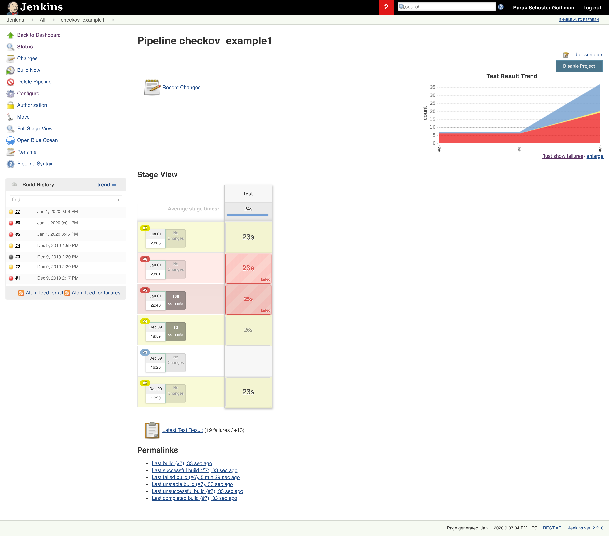
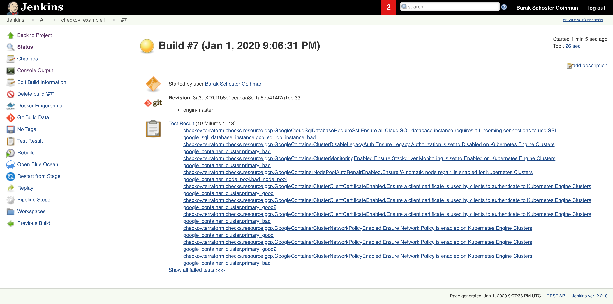
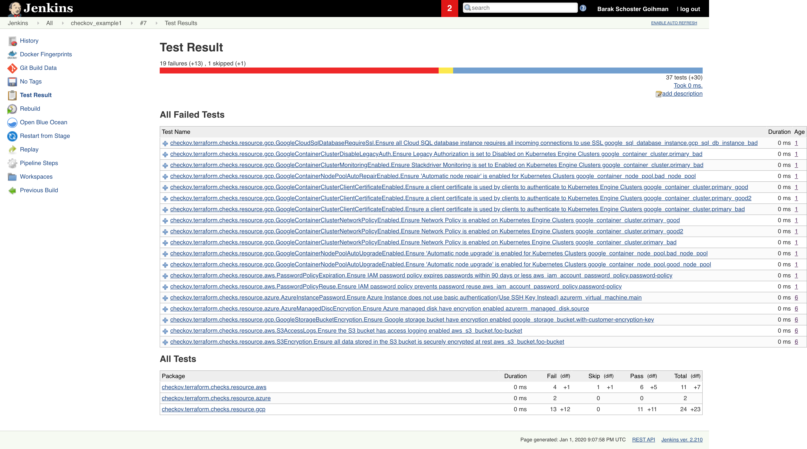

# Integrate Checkov with Jenkins

1. Create new Jenkins Pipeline (or integrate into an existing one)
    
2. Add new a stage into the pipeline definition
    Example:
    
    
    ```groovy
    pipeline {
        agent {
            docker {
                image 'kennethreitz/pipenv:latest'
                args '-u root --privileged -v /var/run/docker.sock:/var/run/docker.sock'
                label 'slave'
            }
        }
        stages {
            stage('test') {
                steps {
                    checkout([$class: 'GitSCM', branches: [[name: 'master']], doGenerateSubmoduleConfigurations: false, extensions: [], submoduleCfg: [], userRemoteConfigs: [[credentialsId: 'github', url: 'git@github.com:bridgecrewio/checkov.git']]])
                    script {
                        sh "pipenv install"
                        sh "pipenv run pip install checkov"
                        sh "pipenv run checkov --directory tests/terraform/runner/resources/example -o junitxml > result.xml || true"
                        junit "result.xml"
                    }
                    
                    
                }
            }
        }
        options {
            preserveStashes()
            timestamps()
            ansiColor('xterm')
        }
    }
    ```
    To enable Checkov on a the project terraform directory modify the directory parameter at the following line:
    ```groovy
    sh "pipenv run checkov --directory $TERRAFORM_MAIN_DIRECTORY_HERE -o junitxml > result.xml || true"
    ```
3. Run `Build Now`

    View build dashboard:
    
    View Job status
    
    Review test result
    
