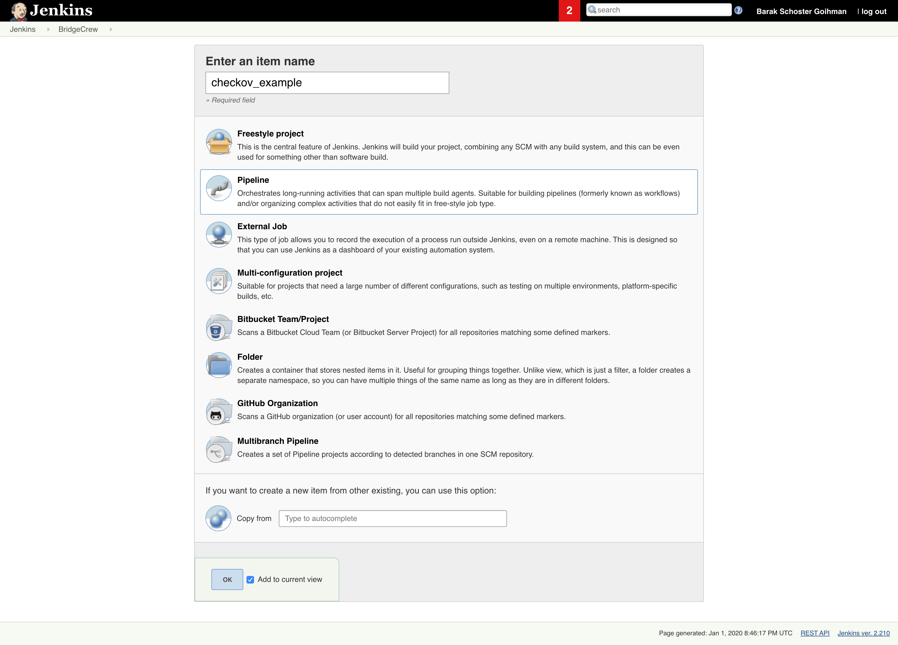

# Integrate Checkov with Jenkins

## Background

Checkov was built to help developers avoid common misconfigurations as they build robust infrastructure-as-code. This simple integration into Jenkins will result in build failures whenever developers create and modify infrastructure as code monitored by Checkov.

To prevent developer frustration from failed builds, we recommend training and encouraging usage of Checkov's inline suppressions.


## Tutorial

1. Create new Jenkins Pipeline or integrate into an existing one.



2. Add new a stage into the pipeline definition using a `pipeline script`

   ```groovy
   pipeline {
       agent {
           docker {
               image 'kennethreitz/pipenv:latest'
               args '-u root --privileged -v /var/run/docker.sock:/var/run/docker.sock'
               label 'slave'
           }
       }
       stages {
           stage('test') {
               steps {
                   checkout([$class: 'GitSCM', branches: [[name: 'master']], doGenerateSubmoduleConfigurations: false, extensions: [], submoduleCfg: [], userRemoteConfigs: [[credentialsId: 'github', url: 'git@github.com:bridgecrewio/checkov.git']]])
                   script {
                       sh "pipenv install"
                       sh "pipenv run pip install checkov"
                       sh "pipenv run checkov --directory tests/terraform/runner/resources/example -o junitxml > result.xml || true"
                       junit "result.xml"
                   }
                   
                   
               }
           }
       }
       options {
           preserveStashes()
           timestamps()
           ansiColor('xterm')
       }
   }
   ```

   

   Modify the directory parameter to enable Checkov on the project terraform directory:

   ```groovy
   sh "pipenv run checkov --directory $TERRAFORM_MAIN_DIRECTORY_HERE -o junitxml > result.xml || true"
   ```

   

   Example
   


3. Run `Build Now`

   

   View build dashboard

   

   

   View job status

   

   

   Review test result

   
