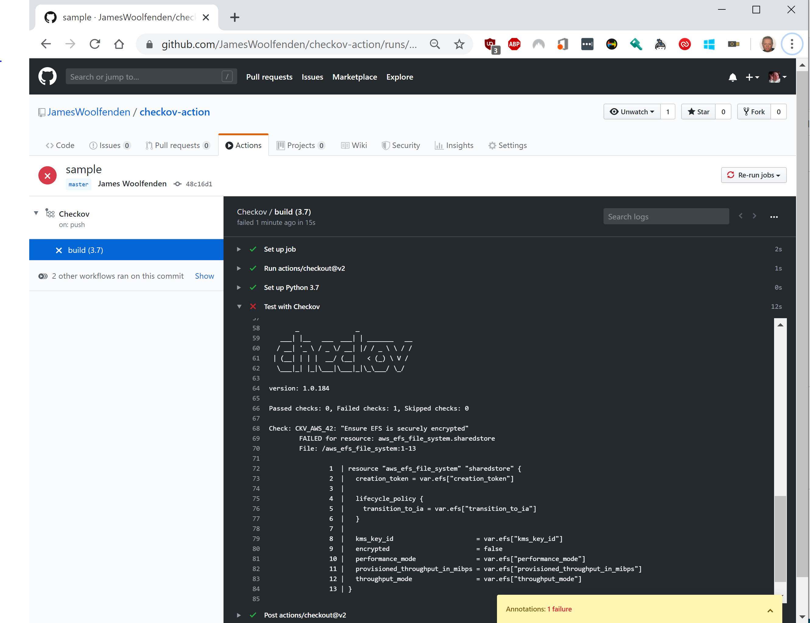
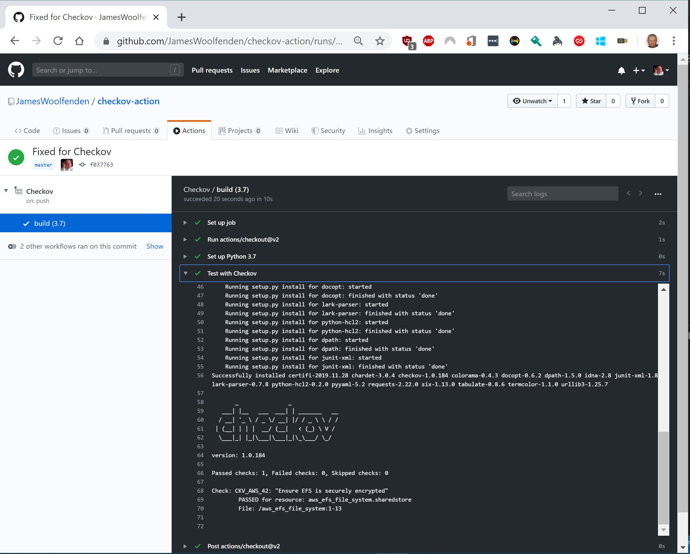

# Integrate Checkov with GitHub Actions

Integrating Checkov into GitHub Actions provides a simple, automatic way of applying policies to your Terraform code both during pull request review and as part of any build process.

## Use a Checkov Action from the Marketplace

Check out our [pre-made action](https://github.com/bridgecrewio/checkov-action).

## Create Your Own Action: Basic Set-up

Add a new step in the `workflow.yml`.

```tree
├───.github
│   └───workflows
```

Here is a basic example:

```yaml
---
name: Checkov
on:
  push:
    branches:
      - master
jobs:
  build:

    runs-on: ubuntu-latest
    steps:
      - uses: actions/checkout@v2
      - name: Set up Python 3.9
        uses: actions/setup-python@v4
        with:
          python-version: 3.9
      - name: Test with Checkov
        id: checkov
        uses: bridgecrewio/checkov-action@master
        with:
          directory: example/examplea
          framework: terraform 
```

## Example Results

Any time after you push your code to GitHub, it will run your job. If Checkov finds any errors, it will fail the build. 

### Action Failure

In the original examples code, the file **aws_efs_file_system.sharedstore.tf** is not set to encrypted:

```python
resource "aws_efs_file_system" "sharedstore" {
  creation_token = var.efs["creation_token"]

  lifecycle_policy {
    transition_to_ia = var.efs["transition_to_ia"]
  }

  kms_key_id                      = var.efs["kms_key_id"]
  encrypted                       = false
  performance_mode                = var.efs["performance_mode"]
  provisioned_throughput_in_mibps = var.efs["provisioned_throughput_in_mibps"]
  throughput_mode                 = var.efs["throughput_mode"]
}
```

This will fail a Checkov test:



### Pipeline Success

The previous error can be fixed by setting the value of encryption to **true**.


[Read more details on using Python in GitHub Actions.](https://help.github.com/en/actions/language-and-framework-guides/using-python-with-github-actions)
