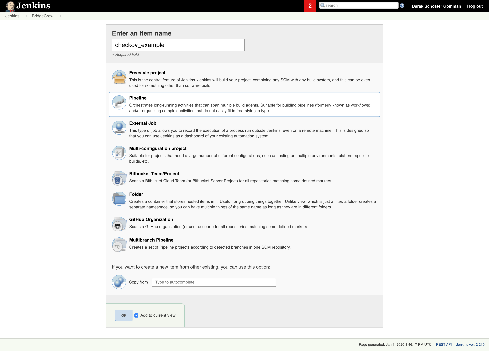
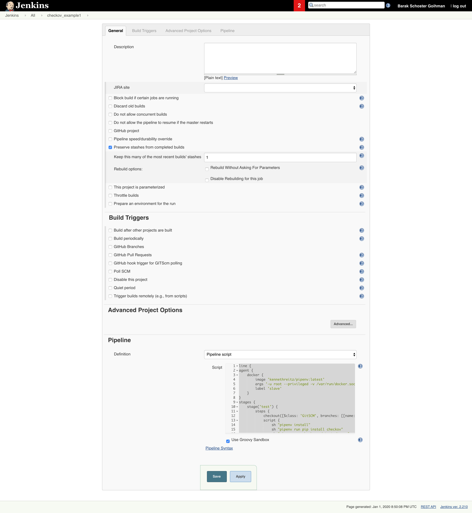
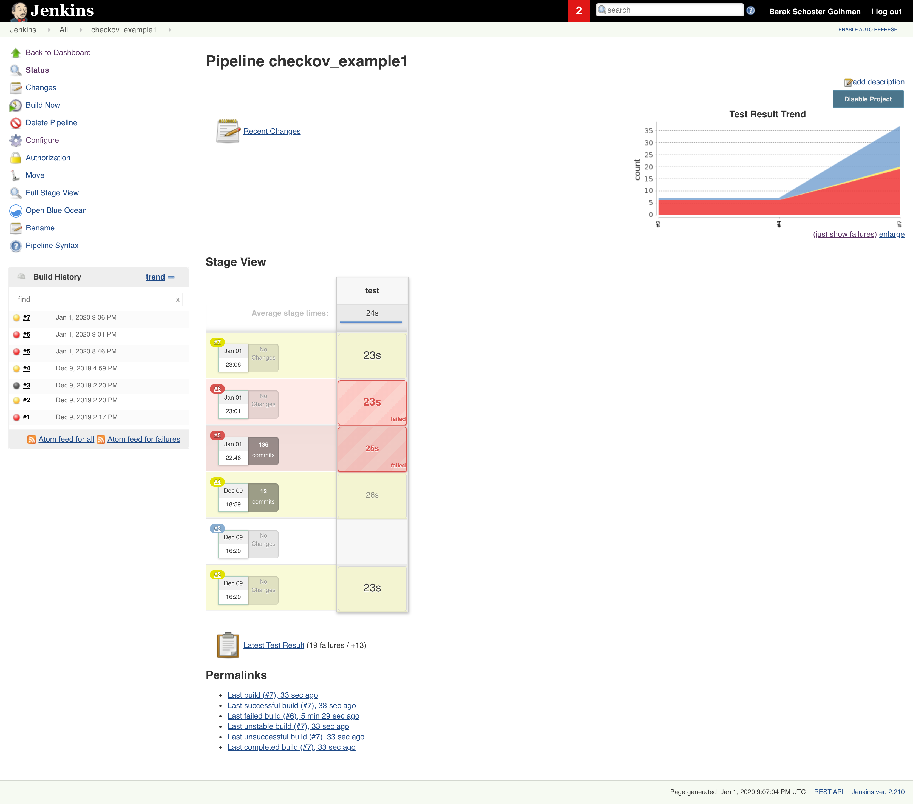
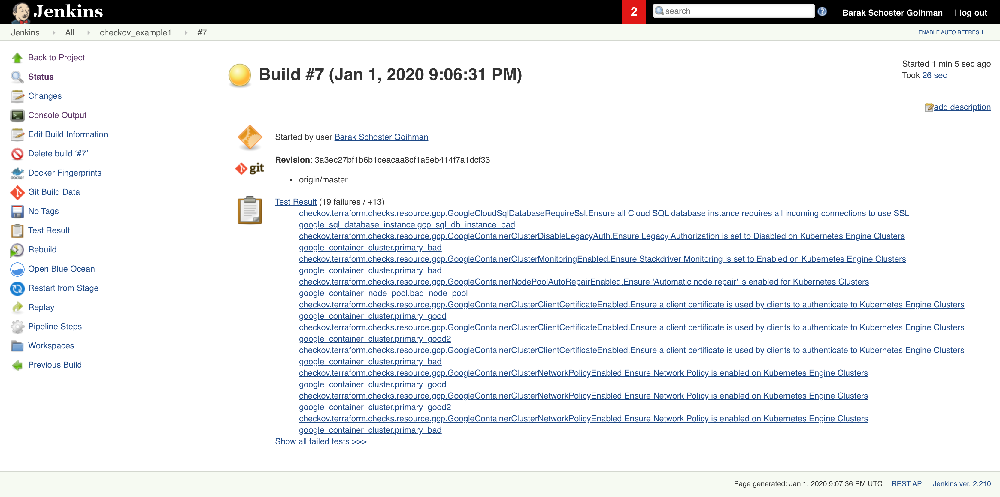
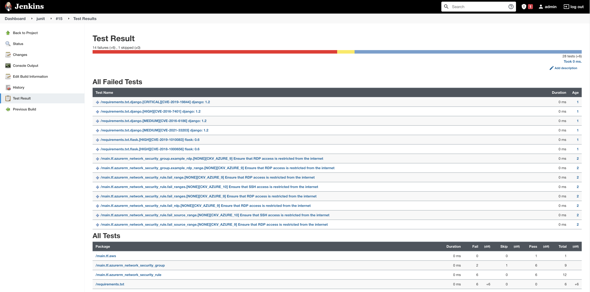

# Integrate Checkov with Jenkins

Below is a simple example integration with Jenkins using the Checkov container image. This will result in build failures whenever developers create and modify infrastructure as code with misconfigurations. To prevent developer frustration from failed builds, we recommend training and encouraging usage of Checkov's inline suppressions.

## Tutorial

1. Create new Jenkins Pipeline or integrate into an existing one.



2. Add new a stage into the pipeline definition using a `pipeline script`

    ```groovy
    pipeline {
        agent any
        
        stages {
            stage('Checkout') {
                steps {
                    git branch: 'master', url: 'https://github.com/bridgecrewio/terragoat'
                    stash includes: '**/*', name: 'terragoat'
                }
            }
            stage('Checkov') {
                steps {
                    script {
                        docker.image('bridgecrew/checkov:latest').inside("--entrypoint=''") {
                            unstash 'terragoat'
                            try {
                                sh 'checkov -d . --use-enforcement-rules -o cli -o junitxml --output-file-path console,results.xml --repo-id example/terragoat --branch master'
                                junit skipPublishingChecks: true, testResults: 'results.xml'
                            } catch (err) {
                                junit skipPublishingChecks: true, testResults: 'results.xml'
                                throw err
                            }
                        }
                    }
                }
            }
        }
        options {
            preserveStashes()
            timestamps()
        }
    }
    ```


   Alternatively, add the following script to install and run Checkov without an image:

   ```groovy
   sh "pipenv run pip install checkov"
   sh "pipenv run checkov -d . --use-enforcement-rules -o cli -o junitxml --output-file-path console,results.xml --repo-id example/terragoat --branch master"
   ```


   Example
   


3. Run `Build Now`


   View build dashboard

   


   View job status

   


   Review test result

   
