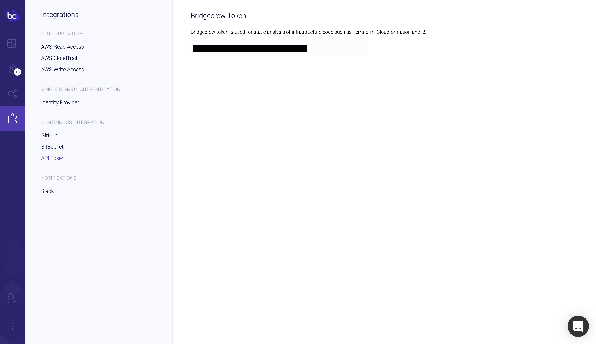
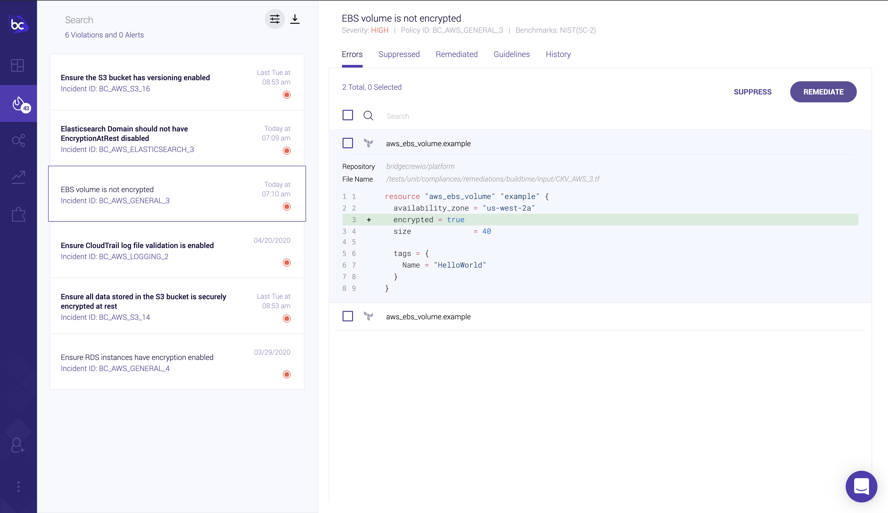

# Integrate Checkov with Bridgecrew Cloud
You can integrate checkov with Bridgecrew's platform. This allows you to include checkov's scan results of a repository
into your Bridgecrew account.

## Setup
First, you need to acquire a Bridgecrew issued API token. To do so, follow these steps:
- Register (for free) to Bridgecrew's platform at [bridgecrew.cloud](https://www.bridgecrew.cloud/)
- After signing in, navigate to the [integrations page](https://www.bridgecrew.cloud/integrations), and click the API Token integration:

- Acquire the issued API key (under the `Bridgecrew Token` title) for execution

## Execution
After acquiring the issued API key, run checkov as follows:

- `checkov -d <directory> --bc-api-key <key> --repo-id <repo_id> --branch <branch>`

Or by using the `-f` file flag:
- `checkov -f <file_1> <file_2> ... <file_n> --bc-api-key <key> --repo-id <repo_id> --branch <branch>`

### Arguments:
- `<key>` - Bridgecrew issued API key
- `<repo_id>` - Identifying string of the scanned repository, following the standard Git repository naming scheme: `<owner>/<name>`
- `<branch>` - Branch name to be persisted on platform, defaults to the master branch. NOTE: please make sure the scanned directory (supplied with `-d` flag)
is currently checked out from the given branch name.

### Environment variables
We strongly recommend that checkov use environment variables that enriches bridgecrew's context with CI/CD systems data.

| Environment variable      | Description                               | Example
| ------------------------- | -----------                               | ------------------------- |
| BC_FROM_BRANCH            | Source branch                             | feature/foo |
| BC_TO_BRANCH              | Target branch                             | main |
| BC_PR_ID                  | Pull request identifier                   | 825 |
| BC_PR_URL                 | Link to pull request/merge request        | https://github.com/bridgecrewio/checkov/pull/825 |
| BC_COMMIT_HASH            | Commit identifier                         | 5df50ab857e7a255e4e731877748b539915ad489 |
| BC_COMMIT_URL             | Link to commit in CI/VCS system           | https://github.com/bridgecrewio/checkov/commit/5df50ab857e7a255e4e731877748b539915ad489 |
| BC_AUTHOR_NAME            | User associated with the CI trigger       | schosterbarak |
| BC_AUTHOR_URL             | Link to the user profile page             | https://github.com/schosterbarak |
| BC_RUN_ID                 | CI run identifier                         | 525220526 |
| BC_RUN_URL                | Link to the run in the CI system          | https://github.com/bridgecrewio/checkov/actions/runs/525220526 |
| BC_REPOSITORY_URL         | Link to the github reposito               | https://github.com/bridgecrewio/checkov/ |
| BC_SOURCE                 | Name of CI system being integrated        | githubActions |

## Bridgecrew cloud view
After successfully terminating, the scan results are persisted on [Bridgecrew Cloud](https://www.bridgecrew.cloud), and are available as possible violations
that can be seen
in the [incidents view](https://www.bridgecrew.cloud/incidents):

## Example usage
The following command scans the repository identified as `foo/bar`, on branch `develop`, using a Bridgecrew API key:
`checkov -d . --bc-api-key 84b8f259-a3dv-5c1e-9422-1bdc9aec0487 --repo-id foo/bar --branch develop`
