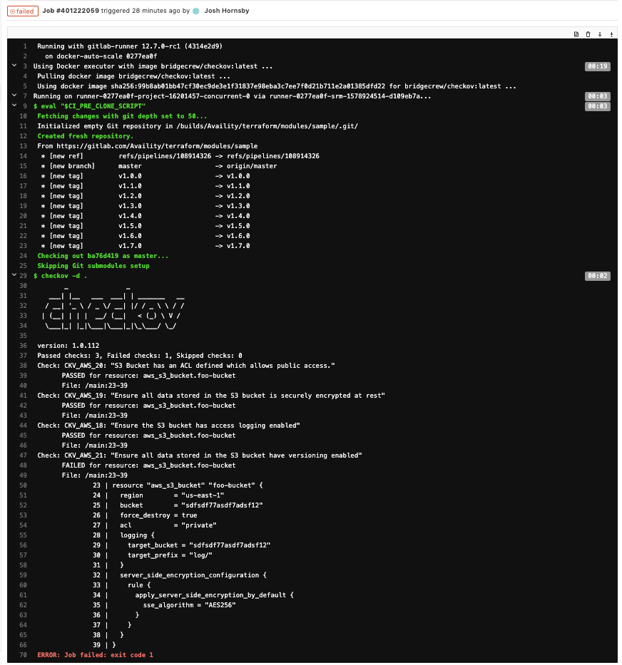

# Integrate Checkov with GitLab CI

You can integrate checkov into your GitLab CI pipelines. This provides a simple, automatic way of applying policies to your Terraform code both during merge request review and as part of your build process.

## Basic Setup

Add a new job in the `.gitlab-ci.yml` file in your repository as part of whichever stage is appropriate for you.

Here is a minimalistic example:
```yaml
stages:
    - validate

checkov:
  image:
    name: bridgecrew/checkov:latest
    entrypoint:
      - '/usr/bin/env'
      - 'PATH=/usr/local/sbin:/usr/local/bin:/usr/sbin:/usr/bin:/sbin:/bin'
  stage: validate
  script:
    - checkov -d .
```

## Example Results

When your pipeline executes, it will run this job. If checkov finds any issues, it will fail the build.

### Pipeline Failure

For example, I have an S3 bucket that does not have versioning enabled. Checkov detects this and fails the job and pipeline.



This will comment on an associated merge request or fail the build depending on the context.

### Pipeline Success

Once I have corrected the configuration, checkov verifies that all is well.


## Further Reading

See the [GitLab CI documentation](https://docs.gitlab.com/ee/ci/) for additional information.