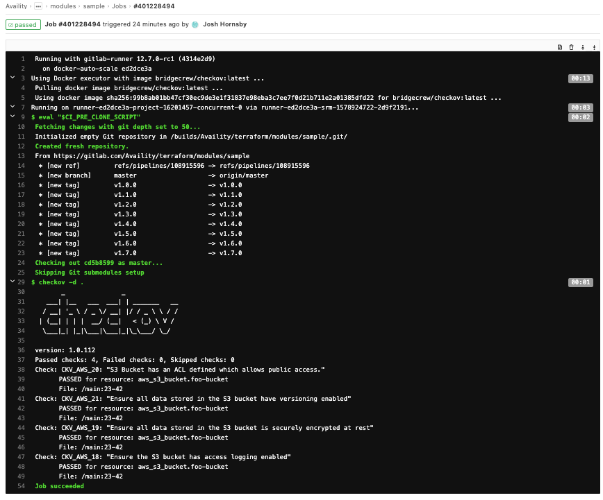

# Integrate Checkov with GitLab CI

You can integrate checkov into your GitLab CI pipelines. This provides a simple, automatic way of applying policies to your Terraform code both during merge request review and as part of your build process.

## Basic Setup

Add a new job in the `.gitlab-ci.yml` file in your repository as part of whichever stage is appropriate for you.

Here is a minimalistic example:
```yaml
stages:
    - test
variables:
  ALLOWFAILURE: true #True for AutoDevOps compatibility

checkov:
  stage: test
  allow_failure: $ALLOWFAILURE
  image:
    name: bridgecrew/checkov:latest
    entrypoint:
      - '/usr/bin/env'
      - 'PATH=/usr/local/sbin:/usr/local/bin:/usr/sbin:/usr/bin:/sbin:/bin'
  rules:
    - if: $SAST_DISABLED
      when: never
    - if: $CI_COMMIT_BRANCH
      exists:
      - '**/*.yml'
      - '**/*.yaml'
      - '**/*.json'
      - '**/*.template'
      - '**/*.tf'
      - '**/serverless.yml'
      - '**/serverless.yaml'
  script:
    - checkov -d . -o junitxml | tee checkov.test.xml
  artifacts:
    reports:
      junit: "checkov.test.xml"
    paths:
      - "checkov.test.xml"
```

## Example Results

When your pipeline executes, it will run this job. If checkov finds any issues, it will fail the build.

### Pipeline Failure

For example, I have an S3 bucket that does not have versioning enabled. Checkov detects this and fails the job and pipeline.


This will comment on an associated merge request or fail the build depending on the context.

GitLab will collect the results into the normal unit testing area of the pipeline and/or the merge request.

### Pipeline Success

Once I have corrected the configuration, checkov verifies that all is well.



## Colored Output

Note that in the above examples the output of the test results does not display colors. This is because GitLab Runner runs without an interactive TTY. Although checkov does not currently support an environment variable to force colored output, the `script` command can be used to emulate `tty` so colors are displayed:
```yaml
stages:
    - test
variables:
  ALLOWFAILURE: true #True for AutoDevOps compatibility

checkov:
  stage: test
  allow_failure: $ALLOWFAILURE
  image:
    name: bridgecrew/checkov:latest
    entrypoint:
      - '/usr/bin/env'
      - 'PATH=/usr/local/sbin:/usr/local/bin:/usr/sbin:/usr/bin:/sbin:/bin'
  rules:
    - if: $SAST_DISABLED
      when: never
    - if: $CI_COMMIT_BRANCH
      exists:
      - '**/*.yml'
      - '**/*.yaml'
      - '**/*.json'
      - '**/*.template'
      - '**/*.tf'
      - '**/serverless.yml'
      - '**/serverless.yaml'
  script:
    # Use `script` to emulate `tty` for colored output.
    - script -q -c 'checkov -d . ; echo $? > CKVEXIT'
    - exit $(cat CKVEXIT)
  artifacts:
    reports:
      junit: "checkov.test.xml"
    paths:
      - "checkov.test.xml"
```

## Further Reading

See the [GitLab CI documentation](https://docs.gitlab.com/ee/ci/) for additional information.
The there is also a working example of using GitLab CI with Checkov here: https://gitlab.com/guided-explorations/ci-cd-plugin-extensions/checkov-iac-sast - this example also shows how to use the same checkov yaml as an includable extension so that all your jobs reuse the same job definition.
