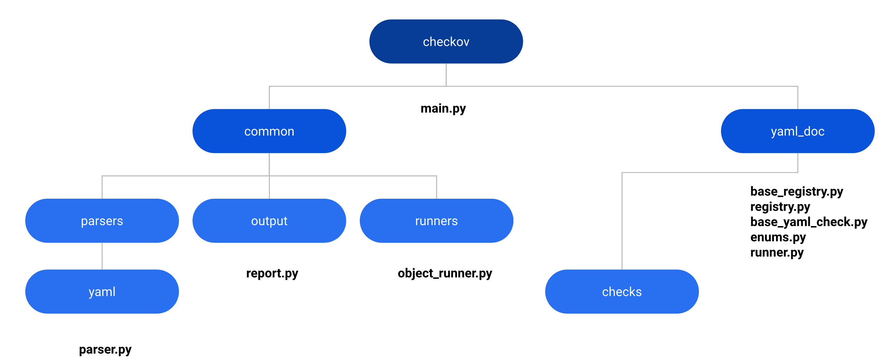

# Checkov Runner Contribution Guide

## Introduction

### Prologue:

Reference PR for the base YAML runner

[https://github.com/bridgecrewio/checkov/pull/2535](https://github.com/bridgecrewio/checkov/pull/2535)

Reference PR for GitHub Action runner (based on the YAML runner)

[https://github.com/bridgecrewio/checkov/pull/2551](https://github.com/bridgecrewio/checkov/pull/2551)

## Glossary

### What is Checkov?

Checkov scans cloud infrastructure configurations to find misconfigurations before they&#39;re deployed.

Checkov uses a common command-line interface to manage and analyze infrastructure as code (IaC) scan results across platforms such as Terraform, CloudFormation, Kubernetes, Helm, ARM Templates and Serverless framework.

### What is a &quot;runner&quot;?

A runner is a unit of code that plugs into the core Checkov &quot;engine&quot; designed to handle the parsing and idiosyncratic formatting of an IaC language such that it can be translated into a set of &quot;definitions&quot;. From there, contributors can create &quot;checks&quot; against the language for best practice and security misconfigurations.

### Further Terminology

**IaC** : This can be purpose-built, declarative languages for Infrastructure as Code for example Terraform or Cloud Formation. They can also be IaC formats like YAML or JSON which can be uniquely interpreted into a stateful format like Kubernetes (YAML or JSON) or GitHub Actions (YAML).

For new IaC formats, In the latter case, a generic JSON or YAML runner already exists to build upon.

**Registry** : A registry is a data structure that collects a group of code objects. There is a registry for &quot;Checks&quot; and a Registry for &quot;Runners&quot; themselves. These allow for Checkov to be extensible. Adding new Checks and new Runners (like we doing here) can be done independently provided the new code is &quot;registered&quot; correctly.

**Runner Registry** : A specific pre-existing registry that tracks all runners Checkov has available.

**Resource** : A single unit within an IaC file upon which a check can be run. A resource may contain other subresource types. An IaC file can have multiple resources within against which Checks can be run.

**NOTE** : There is an advantage to broad resource types which can extend to an entire file. This makes creating checks much easier. The disadvantage is that locations for fixes are far less granular than

### Case Study: Identifying resource types in GitHub Actions YAML

Each **resource** type will require it&#39;s own checks **registry** and **checks**.

Eg. GitHub Actions YAML
```yaml
    on: pull_request
    
    name: unsecure-worfklow
    
    jobs:
    unsecure-job:
    name: job2
    runs-on: ubuntu-latest
    env:
        ACTIONS_ALLOW_UNSECURE_COMMANDS: true
    steps:
        - name: unsecure-step2
        run: |
            echo "goo"
    secure-job:
    name: job3
    runs-on: ubuntu-latest
    env:
        ACTIONS_ALLOW_UNSECURE_COMMANDS: false
    run: |
        echo "ok"
```

Above we can define three potential resource types.

1. The &quot;workflow&quot; file as a whole.
    * Misconfigurations (and Fixes) will be presented against the entire file.
2. The &quot;jobs&quot; which we can see is an array
    * Misconfigurations (and potentially fixes) will be presented within a specified line numbers respective to the job. This is a better user experience and workflows.
3. The &quot;steps&quot; within a job which also can be an array.
    * In this case the most accurate result as misconfigurations (and fixes) will be far more precise and can enable the later use of platform features like Smart Fixes.

**Definition/Entity** : This is an internal abstraction of the &quot;resource&quot; IaC into an internal data structure in Checkov against which our Checkov rules will be applied.

**Check** : An autonomous piece of logic that is run against a &quot;resource&quot; within declarative code structure that traverses and understands the idiosyncratic schema and applies a specific best practice or security checks. 

**Report** : This is where the results of the checks are summarised into a report prior to being output in a variety of formats. Like the definitions, the report is initially a data structure that is independent of the eventually requested format (eg. CycloneDX, JSON, CLI text).

### Option 1: Using YAML or JSON base runners with built-in parsers



##### The major checkov files we will be modifying or inheriting from, for our example runner.

If your runner is using a known IaC language like JSON or YAML then you will be inheriting a lot from these existing runners.

Copy and paste the contents of the &quot;example\_runner&quot; which can be found in ../checkov/example\_runner changing the name to your new runner type.

Eg. cp -r example_runner mynewiac_runner

…where mynewiac\_runner will represent your runner name for the rest of these docs

You&#39;ll be getting, out of the box, a documented set of files within each should be the instructions of what needs to be modified. The tree structure looks like this

    mynewiac_runner
    ├── __init__.py
    ├── checks
    │ ├── __init__.py
    │ ├── base_github_action_check.py
    │ ├── base_github_action_job_check.py
    │ ├── job
    │ │ ├── ExampleCheckTrueFalse.py
    │ │ └── __init__.py
    │ └── job_registry.py
    ├── common
    │ └── __init__.py
    └── runner.py

#### Change the first line in the base __init.py__ to your runner name
Eg. 
    from checkov.mynewiac_runner.checks import *

#### Create a new check type to class CheckType to be used in your new runner

This can be found at the top of the common/output/report.py

    MYNEWIAC = "mynewiac"

Eg. 
    GITHUB_ACTIONS = "github_actions";

#### Add our new check type to our own runner.py file at

This can be found at the top of the class Runner in mynewiac\_runner/runner.py

    check_type = CheckType.MYNEWIAC

#### Define our resources and from there are check registries.

In the example runner there is a checks directory with three key files

    ├── checks
    ├── base_github_action_check.py
    ├── base_github_action_job_check.py
    └── job_registry.py

Where we have the potential for multiple resource types within a single IaC file (a common occurrence), we have created a base check and from there a sub class of this for the specific resource type. In our example case this is a &quot;job&quot;.

Because our resource is a &quot;job&quot; we create a registry for checks to be run against this resource type. You will need to duplicate the base check and registry for each resource type in your IaC.

Return to runner.py to make it unique

There are a few abstract functions defined in the base ObjectRunner that we need to override.

Import\_registry(self): Will register our registries for each block/resource type

\_parse\_file(self.f): Will make a decision as to whether the file &#39;f&#39; is one we care about or not based on unique identity criteria (eg. path, headers, content unique to this IaC). If it is one for us we pass it to the superclass function.

get\_start\_end\_lines(self, end, result\_config, start): For reporting, different IaC resource blocks will have different methods to determine the beginning and end line numbers.

The YAML/JSON runners already handle the &quot;get\_start\_end\_lines&quot; function for us.

Our \_parse\_file for the github actions runner simply filtered out files that we&#39;re not relevant for our runner

Eg.

    if ".github/workflows/"; in os.path.abspath(f):
        return super()._parse_file(f)

Your runner can follow suit and use any number of criteria to ignore files.

**NOTE: By default, all IaC files are passed into all runners to allow the runners to decided if their registry of checks are appropriate. This is where that decision is made.** 

#### Add to checkov/common/utils/docs\_generator.py at the top of the file

    from checkov.mynewiac_runner.checks.job_registry import registry as your_runner_registry

Eg. 
    from checkov.github_actions.checks.job_registry import registry as github_actions_jobs_registry

Add your runner to main.py

Make it visible to Checkov by declaring this dependency. You&#39;ll find these starting from line 18 in main.py.

Your runner can be added to the bottom of the list like

    from checkov.mynewiac_runner.runner import Runner as mynewiac_runner

From here you can then add the call to the runner to the data structure on line 67

    DEFAULT_RUNNERS = 
    ( 
        mynewiac_runner(), 
        cfn_runner(), 
        k8_runner(), 
        sls_runner(), 
        arm_runner(), 


#### Persist added checks into the policy index in the docs (automatically) 
Add the runner directory name to the build.yaml file &quot;for loop&quot;.
.github/workflows/build.yml

Line 141 in build.yaml:

    for i in cloudformation terraform kubernetes serverless arm dockerfile secrets github_configuration gitlab_configuration bitbucket_configuration mynewiac_runner all

Example: [https://github.com/bridgecrewio/checkov/pull/2551/files#diff-5c3fa597431eda03ac3339ae6bf7f05e1a50d6fc7333679ec38e21b337cb6721R141](https://github.com/bridgecrewio/checkov/pull/2551/files#diff-5c3fa597431eda03ac3339ae6bf7f05e1a50d6fc7333679ec38e21b337cb6721R141)

### Now Checkov will call your runner!

#### Create an example check

Reference: 
[Contribute Python-Based Policies](https://github.com/bridgecrewio/checkov/blob/main/docs/6.Contribution/Contribute%20Python-Based%20Policies.md)


#### Create test cases

TBD

