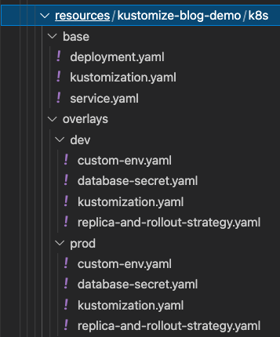

# Scan Kustomize kustomizations with Checkov

Checkov is able to autodetect kustomizations by the presence of a `Kustomization.yaml` file, if found, the the Kustomize framework will automatically be used to template out the referenced kustomization against referenced bases into resulting Kubernetes manifests, which will then be scanned by all Checkovs' Kubernetes policies.

You can think of Kustomize as a "pre-framework". It doesn't currently contain any of it's own policies, rather serves to detect, parse, and provide metadata for Kustomize files to the Kubernetes framework.

Each Overlay/Environment detected will be scanned, Checkov output will provide results for each overlay, and the base kubernetes manifests, so you can see seurity differences between overlays.
Because Kustomizations don't inherently have names, Checkov generates a name for each overlay based on the relative file-path to the base referenced in the `Kustomizations.yaml` file.

For example, The following directory structure will generate 3 sets of checkov violations for, `base:base`, `overlay:dev` and `overlay:prod` environments.



## Dependencies

You will need a working version of the standalone "kustomize" binary in your environment. If not available, Checkov will silently skip the Kustomize framework so as to not break existing CI pipelines which may be pulling Checkov latest with each run.

This is the same behaviour as Helm, and any other frameworks that depend on external dependencies.

```
➜  ~ kustomize version
{Version:kustomize/v4.4.1 GitCommit:b2d65ddc98e09187a8e38adc27c30bab078c1dbf BuildDate:2021-11-11T23:27:14Z GoOs:darwin GoArch:amd64}
```

Installation options for Kustomize can be found here: [https://kubectl.docs.kubernetes.io/installation/kustomize/binaries/](https://kubectl.docs.kubernetes.io/installation/kustomize/binaries/)

## Results

Here we ask for `--compact` output and only a single Kubernetes check `CKV_K8S_43` to make the output easier to read, you can see each Kustomization environment has been templated and scanned with the overlay name appended to the resource.

```
➜  ~ checkov -d ./testdir --framework kustomize --check CKV_K8S_43 --quiet --compact

kustomize scan results:

Passed checks: 0, Failed checks: 12, Skipped checks: 0

Check: CKV_K8S_43: "Image should use digest"
        FAILED for resource: base:Deployment.default.sl-demo-app
        File: /Users/matt/bcd/kustomize/checkov/testdir/kustomize-blog-demo/k8s/base/kustomization.yaml:

Check: CKV_K8S_43: "Image should use digest"
        FAILED for resource: overlay:overlays/prod:Deployment.default.sl-demo-app
        File: /Users/matt/bcd/kustomize/checkov/testdir/kustomize-blog-demo/k8s/overlays/prod/kustomization.yaml:

Check: CKV_K8S_43: "Image should use digest"
        FAILED for resource: overlay:overlays/dev:Deployment.default.sl-demo-app
        File: /Users/matt/bcd/kustomize/checkov/testdir/kustomize-blog-demo/k8s/overlays/dev/kustomization.yaml:

Check: CKV_K8S_43: "Image should use digest"
        FAILED for resource: overlay:overlays/prod-2:Deployment.default.sl-demo-app
        File: /Users/matt/bcd/kustomize/checkov/testdir/kustomize-blog-demo/k8s/overlays/prod-2/kustomization.yaml:

Check: CKV_K8S_43: "Image should use digest"
        FAILED for resource: overlay:overlays/prod-4:Deployment.default.sl-demo-app
        File: /Users/matt/bcd/kustomize/checkov/testdir/kustomize-blog-demo/k8s/overlays/prod-4/kustomization.yaml:

Check: CKV_K8S_43: "Image should use digest"
        FAILED for resource: overlay:overlays/prod-3:Deployment.default.sl-demo-app
        File: /Users/matt/bcd/kustomize/checkov/testdir/kustomize-blog-demo/k8s/overlays/prod-3/kustomization.yaml:

Check: CKV_K8S_43: "Image should use digest"
        FAILED for resource: base:Deployment.default.sl-demo-app
        File: /Users/matt/bcd/kustomize/checkov/testdir/example-monorepo-structure/k8s/base/kustomization.yaml:

Check: CKV_K8S_43: "Image should use digest"
        FAILED for resource: overlay:overlays/prod:Deployment.default.sl-demo-app
        File: /Users/matt/bcd/kustomize/checkov/testdir/example-monorepo-structure/k8s/overlays/prod/kustomization.yaml:

Check: CKV_K8S_43: "Image should use digest"
        FAILED for resource: overlay:overlays/dev:Deployment.default.sl-demo-app
        File: /Users/matt/bcd/kustomize/checkov/testdir/example-monorepo-structure/k8s/overlays/dev/kustomization.yaml:

Check: CKV_K8S_43: "Image should use digest"
        FAILED for resource: overlay:overlays/prod-2:Deployment.default.sl-demo-app
        File: /Users/matt/bcd/kustomize/checkov/testdir/example-monorepo-structure/k8s/overlays/prod-2/kustomization.yaml:

Check: CKV_K8S_43: "Image should use digest"
        FAILED for resource: overlay:overlays/prod-4:Deployment.default.sl-demo-app
        File: /Users/matt/bcd/kustomize/checkov/testdir/example-monorepo-structure/k8s/overlays/prod-4/kustomization.yaml:

Check: CKV_K8S_43: "Image should use digest"
        FAILED for resource: overlay:overlays/prod-3:Deployment.default.sl-demo-app
        File: /Users/matt/bcd/kustomize/checkov/testdir/example-monorepo-structure/k8s/overlays/prod-3/kustomization.yaml:

```
