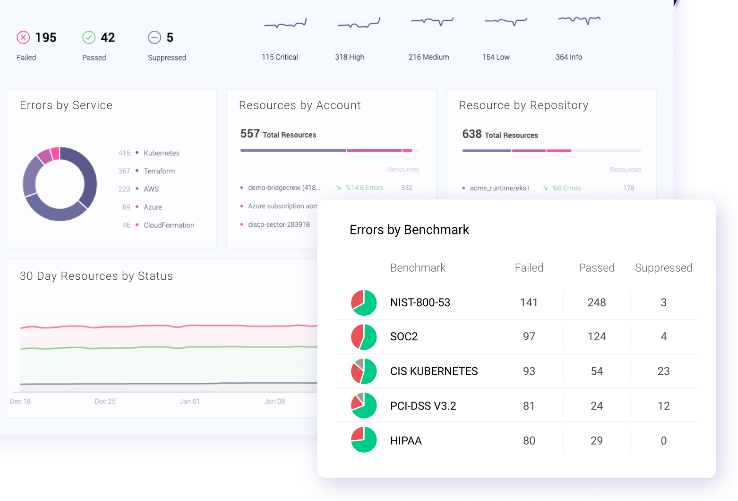
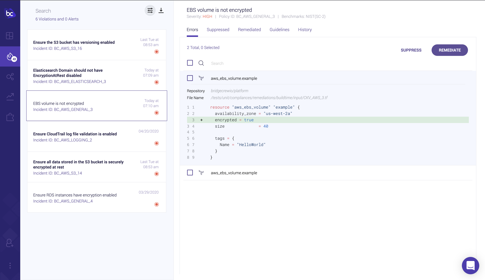

You can integrate Checkov with Bridgecrew to view the results of Checkov scans in the Bridgecrew platform.


## Integration

### Get your API Token

To get a Bridgecrew issued API token:

1. Sign up for a free [Bridgecrew account](https://www.bridgecrew.cloud/).
2. Navigate to the [Integrations page](https://www.bridgecrew.cloud/integrations) and select **API Token**.


3. Copy the API token.

## Execution

After acquiring the API token, run Checkov as follows:

```shell
checkov -d <directory> --bc-api-key <key> --repo-id <repo_id> --branch <branch>
```

Or by using the `-f` file flag:

```shell
checkov -f <file_1> <file_2> ... <file_n> --bc-api-key <key> --repo-id <repo_id> --branch <branch>
```

The table below details the arguments used when executing the API token:

| Argument | Description |
| -------- | ----------- |
| `<key>` | Bridgecrew issued API key |
| `<repo_id>` | Identifying string of the scanned repository, following the standard Git repository naming scheme: `<owner>/<name>` |
| `<branch>` | Branch name to be persisted on platform. Defaults to the master branch. **NOTE:** Ensure the scanned directory (supplied in the `-d` flag) is currently checked out from the given branch name. |

### Environment Variables

To enrich Bridgecrew's context with CI/CD systems data, we strongly recommend that Checkov uses environment variables.

| Environment Variable | Description | Example |
| -------- | ----------- | ----------- |
| BC_FROM_BRANCH | Source branch | feature/foo |
| BC_TO_BRANCH | Target branch | main |
| BC_PR_ID | Pull request identifier | 825 |
| BC_PR_URL | Link to pull request/merge request | https://github.com/bridgecrewio/checkov/pull/825 |
| BC_COMMIT_HASH | Commit identifier | 5df50ab857e7a255e4e731877748b539915ad489 |
| BC_COMMIT_URL | Link to commit in CI/VCS system | https://github.com/bridgecrewio/checkov/commit/5df50ab857e7a255e4e731877748b539915ad489 |
| BC_AUTHOR_NAME | User associated with the CI trigger | schosterbarak |
| BC_AUTHOR_URL | Link to the user profile page | https://github.com/schosterbarak |
| BC_RUN_ID | CI run identifier | 525220526 |
| BC_RUN_URL | Link to the run in the CI system | https://github.com/bridgecrewio/checkov/actions/runs/525220526 |
| BC_REPOSITORY_URL | Link to the GitHub repository | https://github.com/bridgecrewio/checkov/ |
| BC_SOURCE | Name of CI system being integrated | githubActions |

## Bridgecrew platform view

After successfully executing, scan results are persisted in [Bridgecrew](https://www.bridgecrew.cloud), and can be seen in the [Incidents screen](https://www.bridgecrew.cloud/incidents).


## Example Usage

The following command scans the repository identified as `foo/bar`, on branch `develop`, using a Bridgecrew API key:

```shell
checkov -d . --bc-api-key 84b8f259-a3dv-5c1e-9422-1bdc9aec0487 --repo-id foo/bar --branch develop
```
