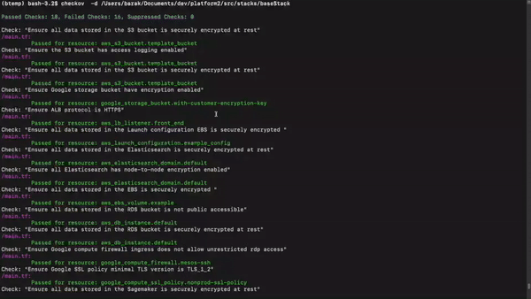

# Checkov Documentation

Checkov is a static code analysis tool for infrastructure-as-code. 

Checkov is written in Python and aims to simplify and increase the adoption of security and compliance best practices that prevent common cloud misconfigurations. Its scans adhere and implement common industry standards such as the Center for Internet Security (CIS) Amazon Web Services (AWS) Foundations Benchmark.

Checkov supports JUnit XML format that enables simple integration to CICD pipelines. Read more about it in the [Results](Results) 

See how to [install and get Checkov up and running](Introduction/GettingStarted.md).

Next [learn how to customize and add policies](Introduction/Policies.md).

