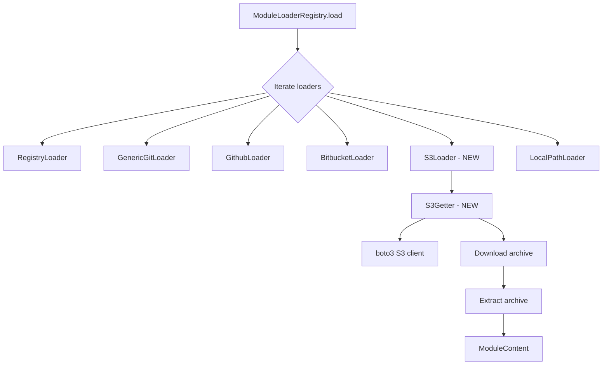

# Plan: S3 Bucket Module Loader for Terraform External Modules

## Overview

Add support for downloading external Terraform modules from AWS S3 buckets. Terraform supports S3 as a module source using the `s3::` prefix format (see [Terraform S3 Bucket Sources](https://developer.hashicorp.com/terraform/language/modules/sources#s3-bucket)).

### Terraform S3 Source Format

```hcl
module "vpc" {
  source = "s3::https://s3-eu-west-1.amazonaws.com/examplecorp-terraform-modules/vpc.zip"
}
```

The format is: `s3::https://<s3-endpoint>/<bucket>/<key>`

Where the URL after `s3::` is a standard S3 HTTP URL. The S3 URL can take multiple forms:
- Path-style: `s3::https://s3-<region>.amazonaws.com/<bucket>/<key>`
- Virtual-hosted-style: `s3::https://<bucket>.s3-<region>.amazonaws.com/<key>`
- Also supports `//` for inner modules: `s3::https://s3.amazonaws.com/bucket/module.zip//subdir`

## Architecture

The implementation follows the existing loader pattern established by other loaders (Git, GitHub, Bitbucket, Registry).



## Authentication Strategy

Use **boto3 default credential chain**, which is the same approach Terraform uses with the AWS SDK. This provides maximum compatibility:

1. **Environment variables**: `AWS_ACCESS_KEY_ID`, `AWS_SECRET_ACCESS_KEY`, `AWS_SESSION_TOKEN`
2. **Shared credential file**: `~/.aws/credentials`
3. **AWS config file**: `~/.aws/config` with profiles
4. **IAM instance profile**: For EC2/ECS/Lambda environments

Additionally, support an optional `AWS_PROFILE` environment variable for profile selection, and an optional `S3_MODULE_AWS_REGION` environment variable to override the region extracted from the URL.

boto3 is already a project dependency (`boto3==1.35.49` in `setup.py`).

## Files to Create/Modify

### 1. NEW: `checkov/common/goget/s3/__init__.py`
Empty init file for the S3 goget package.

### 2. NEW: `checkov/common/goget/s3/get_s3.py`
S3 getter class following the pattern of [`RegistryGetter`](checkov/common/goget/registry/get_registry.py).

**Responsibilities:**
- Parse S3 URL to extract bucket, key, and region
- Download the object from S3 using boto3
- Extract the archive (zip, tar.gz, etc.) to the destination directory
- Support both path-style and virtual-hosted-style S3 URLs

**Key class: `S3Getter(BaseGetter)`**
- `__init__(self, url: str, create_clone_and_result_dirs: bool = False)` - Parse the S3 URL
- `do_get(self) -> str` - Download from S3 and extract
- `_parse_s3_url(self, url: str) -> tuple[str, str, str]` - Extract bucket, key, region from URL

### 3. NEW: `checkov/terraform/module_loading/loaders/s3_loader.py`
S3 module loader following the pattern of [`GenericGitLoader`](checkov/terraform/module_loading/loaders/git_loader.py).

**Key class: `S3Loader(ModuleLoader)`**
- `discover(self, module_params)` - Read AWS-related env vars
- `_is_matching_loader(self, module_params)` - Check if source starts with `s3::`
- `_load_module(self, module_params)` - Use S3Getter to download and extract
- `_find_module_path(self, module_params)` - Compute expected local path

**Source matching logic:**
- Match sources starting with `s3::` prefix
- Handle inner modules via `//` separator (e.g., `s3::https://...bucket/module.zip//subdir`)

### 4. MODIFY: [`checkov/terraform/module_loading/__init__.py`](checkov/terraform/module_loading/__init__.py)
Add import for `S3Loader` to register it. Insert before `LocalPathLoader` since order matters.

### 5. MODIFY: [`checkov/terraform/module_loading/loaders/registry_loader.py`](checkov/terraform/module_loading/loaders/registry_loader.py:44)
Add `"s3::"` to the list of prefixes that cause `_is_matching_loader` to return `False`, preventing the registry loader from trying to handle S3 sources.

### 6. MODIFY: [`checkov/common/util/ext_argument_parser.py`](checkov/common/util/ext_argument_parser.py:378)
Update the help text for `--download-external-modules` to mention S3 buckets.

### 7. NEW: `tests/common/goget/s3/__init__.py`
Empty init file for tests.

### 8. NEW: `tests/common/goget/s3/test_get_s3.py`
Unit tests for the S3Getter class:
- Test URL parsing for path-style URLs
- Test URL parsing for virtual-hosted-style URLs
- Test `do_get()` with mocked boto3 client
- Test error handling for invalid URLs

### 9. NEW: `tests/terraform/module_loading/test_s3_loader.py`
Unit tests for the S3Loader:
- Test `_is_matching_loader` with various S3 source formats
- Test `_is_matching_loader` returns False for non-S3 sources
- Test `_load_module` with mocked S3Getter
- Test inner module handling with `//` separator
- Test `_find_module_path` returns correct paths

## Detailed Implementation Notes

### S3 URL Parsing

The S3 URL after the `s3::` prefix can be in several formats:

| Format | Example |
|--------|---------|
| Path-style with region | `https://s3-eu-west-1.amazonaws.com/bucket/key.zip` |
| Path-style default region | `https://s3.amazonaws.com/bucket/key.zip` |
| Virtual-hosted with region | `https://bucket.s3-eu-west-1.amazonaws.com/key.zip` |
| Virtual-hosted default region | `https://bucket.s3.amazonaws.com/key.zip` |

The parser should extract:
- **bucket**: The S3 bucket name
- **key**: The object key within the bucket
- **region**: The AWS region, defaulting to `us-east-1` if not specified

### Inner Module Support

Like other loaders, S3 sources can reference inner modules using `//`:
```
s3::https://s3.amazonaws.com/bucket/module.zip//modules/vpc
```

The loader should:
1. Split on `//` to separate the archive URL from the inner module path
2. Download and extract the archive
3. Return the path to the inner module subdirectory

### Archive Format Detection

Reuse the same archive extension detection logic from [`RegistryLoader._get_archive_extension()`](checkov/terraform/module_loading/loaders/registry_loader.py:234). Supported formats: zip, tar.bz2, tar.gz, tgz, tar.xz, txz.

### Error Handling

- **Missing credentials**: Log a warning and return `ModuleContent(dir=None)`
- **Bucket/key not found**: Log a warning and return `ModuleContent(dir=None, failed_url=...)`
- **Network errors**: Log a warning and return `ModuleContent(dir=None, failed_url=...)`
- **Unsupported archive format**: Log a warning and return `ModuleContent(dir=None)`

### Loader Registration Order

The S3 loader should be registered in [`__init__.py`](checkov/terraform/module_loading/__init__.py) after the git-based loaders but before `LocalPathLoader`:

```python
from checkov.terraform.module_loading.loaders.registry_loader import RegistryLoader
from checkov.terraform.module_loading.loaders.git_loader import GenericGitLoader
from checkov.terraform.module_loading.loaders.github_loader import GithubLoader
from checkov.terraform.module_loading.loaders.bitbucket_loader import BitbucketLoader
from checkov.terraform.module_loading.loaders.github_access_token_loader import GithubAccessTokenLoader
from checkov.terraform.module_loading.loaders.bitbucket_access_token_loader import BitbucketAccessTokenLoader
from checkov.terraform.module_loading.loaders.s3_loader import S3Loader          # NEW
from checkov.terraform.module_loading.loaders.local_path_loader import LocalPathLoader
```

## Testing Strategy

All tests should mock boto3 to avoid requiring real AWS credentials:

```python
@mock.patch("checkov.common.goget.s3.get_s3.boto3")
def test_s3_download(mock_boto3, tmp_path):
    # Mock S3 client and download behavior
    ...
```

Integration with the `ModuleLoaderRegistry` should be tested similarly to existing loader tests in [`test_registry.py`](tests/terraform/module_loading/test_registry.py), using `mock.patch` on the S3Getter.
